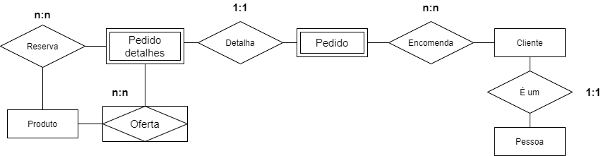
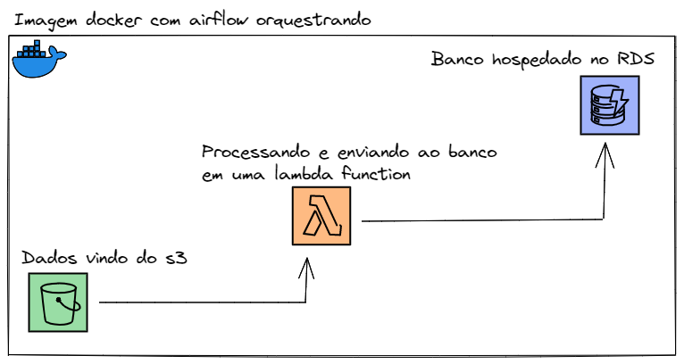

## Sobre o Projeto 
Minha solução para o teste técnico para vaga de Engenheiro de Dados Jr na Rox Partner

### Construido Com
* [Python](https://www.python.org/)
* [SQLAlchemy](https://www.sqlalchemy.org/)
* [Pandas](https://pandas.pydata.org/)
* [Postgresql](https://www.postgresql.org/)
* [Docker](https://www.docker.com/)
* [Apache Airflow](https://airflow.apache.org/)
* [AWS Lambda](https://aws.amazon.com/pt/lambda/?nc2=type_a)
* [AWS s3](https://aws.amazon.com/pt/s3/?nc2=type_a)
* [AWS RDS](https://aws.amazon.com/pt/rds/?nc2=type_a)

### Estrutura de Diretórios
```sh
|--docker-compose #Pasta com o compose file e dags criadas
	|--dags
		|--sql_files
			|--delete_tables.sql
		|--lamba.py
	|--docker-compose.yaml
|--lambda-function #Código da lambda function
	|--data_getter.py
	|--handler.py
	|--lambda_function.py
|--sql #arquivos .sql com as queries para as perguntas de analise de dados
	|--pergunta_1.sql
	|--pergunta_2.sql
	|--pergunta_3.sql
	|--pergunta_4.sql
	|--pergunta_5.sql
```

## Análise de Dados
1. Escreva uma query que retorna a quantidade de linhas na tabela Sales.SalesOrderDetail pelo campo SalesOrderID, desde que tenham pelo menos três linhas de detalhes.
```sql
WITH cte_sales
AS (
	SELECT sod."SalesOrderID"
		,count(sod."SalesOrderDetailID") AS qtd_linhas
	FROM "SalesOrderDetail" sod
	GROUP BY sod."SalesOrderID"
	)
	
SELECT *
FROM cte_sales
WHERE qtd_linhas >= 3;
```
2. Escreva uma query que ligue as tabelas Sales.SalesOrderDetail, Sales.SpecialOfferProduct e Production.Product e retorne os 3 produtos (Name) mais vendidos (pela soma de OrderQty), agrupados pelo número de dias para manufatura (DaysToManufacture).
```sql
SELECT p."Name"
	,p."DaysToManufacture"
	,sum(sod."OrderQty") AS qtd
FROM "SalesOrderDetail" sod
LEFT JOIN "SpecialOfferProduct" sop ON sop."SpecialOfferID" = sod."SpecialOfferID"
LEFT JOIN "Product" p ON p."ProductID" = sop."ProductID"
GROUP BY p."Name"
	,p."DaysToManufacture"
ORDER BY 3 DESC limit 3;
```
3. Escreva uma query ligando as tabelas Person.Person, Sales.Customer e Sales.SalesOrderHeader de forma a obter uma lista de nomes de clientes e uma contagem de pedidos efetuados.

```sql
SELECT CONCAT (
		p."FirstName"
		,' '
		,p."MiddleName"
		,' '
		,p."LastName"
		) AS name
	,count(soh."SalesOrderID") AS qtd_compras
FROM "Person" p
JOIN "Customer" c ON c."PersonID" = p."BusinessEntityID"
JOIN "SalesOrderHeader" soh ON soh."CustomerID" = c."CustomerID"
GROUP BY 1
ORDER BY 2 DESC;
```
4.	Escreva uma query usando as tabelas Sales.SalesOrderHeader, Sales.SalesOrderDetail e Production.Product, de forma a obter a soma total de produtos (OrderQty) por ProductID e OrderDate.
```sql
select
sod."ProductID"
,soh."OrderDate"
,sum(sod."OrderQty") as qtd
from "SalesOrderHeader" soh 
join "SalesOrderDetail" sod on soh."SalesOrderID" = sod."SalesOrderID"
group by sod."ProductID",
		 soh."OrderDate"
order by 3 desc;
```
5.	Escreva uma query mostrando os campos SalesOrderID, OrderDate e TotalDue da tabela Sales.SalesOrderHeader. Obtenha apenas as linhas onde a ordem tenha sido feita durante o mês de setembro/2011 e o total devido esteja acima de 1.000. Ordene pelo total devido decrescente.
```sql
SELECT soh."SalesOrderID"
	,soh."OrderDate"
	,replace(soh."TotalDue", ',', '.')::FLOAT AS qtd
FROM "SalesOrderHeader" soh
WHERE replace(soh."TotalDue", ',', '.')::FLOAT > 1000
	AND (
		extract(year FROM soh."OrderDate"::DATE) = 2011
		AND extract(month FROM soh."OrderDate"::DATE) = 9
		)
ORDER BY replace(soh."TotalDue", ',', '.')::FLOAT DESC;
```
## Modelagem conceitual dos dados


## Arquitetura do projeto


Para minha solução, criei a arquitetura acima, tomei a liberdade de considerar que os dados brutos viriam de um bucket do s3, por ser um serviço barato e prático de armazenamento em cloud
e vários outros serviços de dados da AWS se comunicam com facilidade com o mesmo. Após decidir a fonte das informações, ao pensar onde iria acontecer o processamento dos dados e o envio para o banco
pensei em usar o AWS Glue, porém pela precificação e poder de processamento (que justifica o preço), seria um desperdicio utilizar para uma carga de dados simples, então me veio a ideia de utilizar uma Lamba Function,
por ser um serviço que cobra apenas pelo tempo de processamento, com uma carga leve de trabalho, que hipoteticamente tenderia a rodar poucas ou apenas uma vez ao dia, a quantia cobrada seria ínfima e sem perder muita performance.
Considerei utilizar o RDS para dar deploy de um banco Postgresql, pois deixo o encargo da infraestrutura e configuração do banco toda a encargo do serviço da AWS, tornando o processo mais simples. E por fim, utilizei o Apache Airflow para orquestrar a execução dessa Lambda por meio de um endpoint.

## Implementação

* Para a implementação, inicialmente enviei os csv's para um bucket do s3 com a seguinte estrutura de diretórios:
```sh
|--person
  |--Person.Person.csv
|--production
  |--Production.Product.csv
|--sales
  |--Sales.Customer.csv
  |--Sales.SalesOrderDetail.csv
  |--Sales.SalesOrderHeader.csv
  |--Sales.SpecialOfferProduct.csv
```

* Em seguida, subi uma instância do Postgres pelo RDS, e abri o acesso público do mesmo.

* Posteriormente, segui para a construção da lambda function. Inicialmente tive alguns problemas em colocar bibliotecas externas, porém conseguir resolver o problema utilizando o sistema de layers para cada biblioteca utilizada. A abordagem é bem direta, primeiro me conecto com o bucket do s3 pela lib boto3 e baixo os arquivos de dados, em seguida faço a conexão com o postgres pelo SQLAlchemy, após isso utilizo o pandas para carregar os csv's como DataFrames, para simplificar a manipulação, e por fim, dou insert no banco em batch.

* Para a Lambda, reservei 512 mb de ram, a mesma demora 3 minutos para rodar. Com mais tempo eu teria conseguido otimizar, porém tinham outras partes do projeto a serem desenvolvidas.
* E por fim, escrevi uma DAG no airflow, utilizando o [hook aws lambda](https://airflow.apache.org/docs/apache-airflow/1.10.12/_api/airflow/contrib/hooks/aws_lambda_hook/index.html) para alavancar a Lambda remotamente.

## Utilização

### Requisitos Para Utilização do Software
* Docker
```sh
sudo apt get docker
```
* Docker-compose
```sh
sudo apt get docker-compose
```

### Instalação
* Clone o repositório
```sh
git clone https://github.com/brianamaral/rox-test-data-engineer.git
```

### Uso
* Vá até a pasta docker-compose, e execute em seu shell:
```sh
docker-compose up airflow-init
```
* Quando você vir a seguinte mensagem em seu shell, pode prosseguir:
```sh
start_airflow-init_1 exited with code 0
```
* Em seguida execute o comando:
```sh
docker-compose up
```
* Acesse o endereço localhost:8080 e logue com login e senha repassados pelo arquivo anexado no email.

* É necessário adicionar duas conexões no airflow, para poder executar as dags, uma do tipo Amazon Web Services e outra do tipo Postgres (dados de conexão anexados).

* E por fim, você pode executar a dag manualmente.

